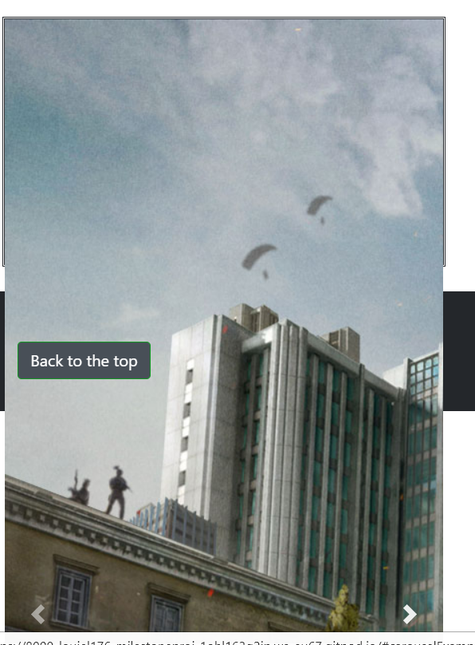
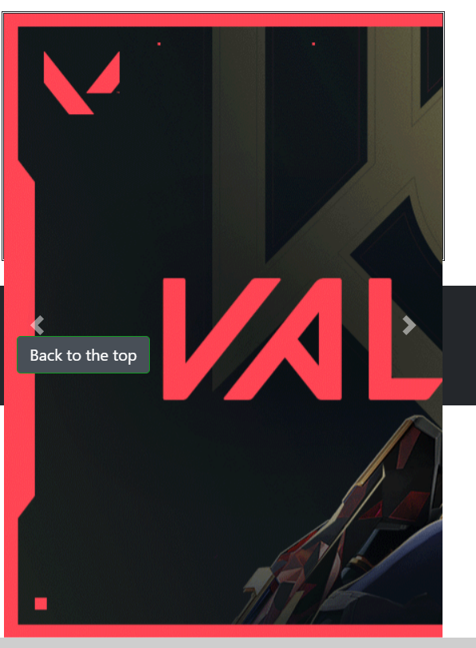
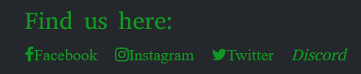
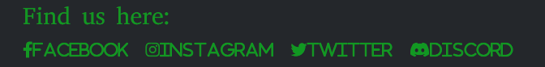

# Milestone Project 1

## UX:

### Project goals:

The goal of this website is to create a community that makes users feels welcomed and confident in asking and helping other users with different video games. The landing page will show the user Who the company is and what they want to achieve with the website. The landing page of the site will show a brief description of the current team and a brief description of who they are. The about us page will show the main description of the team as well as use images to show what gaming setups they use and what games they like playing as well as a little description of what they do. This is to show users no matter what they do they can always find comfort in knowing they will always be supported in their gaming hobbies and will be able to find some useful players and make friends along the way. The enquires page will allow users to contact the company about any questions they may have towards games or the company in general.

### User goals:

The target audience for this website are gamers new or old.

The goals of the site are as followed:

- to create a community
- to allow communication between users and the company
- a safe and comfortable enviroment
- to meet the team already apart of the community
- to feel safe communicating with individuals that are used to making friends online and gaming with them

### Developer goals:

- make a friendly and easy to use website
- allow the users to meet the team behind the business
- allow the users to feel comfortable getting in contact
- allow users to contact the company via an enquires page
- allow users to see what the team do for their jobs and hobbies

## Structure:

 The structure of the website will contain a homogenous navigation bar that will bw comprised of three button links the first of which will be a link back to the homepage and this will be the companys name, the next link will be the 'meet the team' button which will link to the second page and the third link will be a link called 'enquires' to link to the third page. The navigation bar will be mobile responsive and will change to a drop down menu using the 'burger icon' this will be so it fits nicely on to a smaller screen and easy to use by the users.

 All three pages will be styled using custom CSS/CSS3 as well as using the help from prewritten code such as bootstrap 4, this is so that the users can experience a custom feel to the website and feel welcomed knowing that the company cares what the website looks like to make new users become recurring users. The three pages will also be responsive, this will be done by the use of CSS, bootstrap and media queries. This is so that whether the user is using a mobile device, a tablet or a computer they will be able to see the full width of the website without cutting anything out or having to have a horizontal scroll bar just to see the website.

 The use of media queries will allow the website to shrink to fit any users devices or expand if going from a smaller device to a bigger one. The use of media queries will mean that any element that are set to a certain measurement maybe set to a new measurement on other devices so that it can fit comfortably in the intended screen sizes. The text on pages will not change so that the user can still read the text without having to change their zoom size this being said it may mean that the user may have to scroll vertically depending on the overall size of the amount of text in a specific element.

 The footer element will also be homogeneous as it will be set out to have a 'back to top' button allowing the user to link back to the top of their current page this is so that the user will not have to scroll up their page to get back to the top. Along side this the footer will also include social links to the following sites:

 - Facebook
 - Twitter
 - Instagram
 - Discord

These will all include their respective icons as well as their names. The footer element will also use media queries this is so that when a user browses the site on a mobile device they will not have the names causing them to have to scroll horizontally, they will just be able to see the icons themselves.

 The landing page will be comprised of the nav bar mentioned above as well as a hero image with text inside this box allowing the user to find out a little bit of information about the company and why they have made the website. This will be followed by three slideshow image boxes that will be layed out in a 2 1 formation, this meaning that the first two boxes will be positioned besides eachother with margins to keep the boxes seperated and the third will be centered underneath the two other boxes. This will allow the user to interact with each of them to see different images of games that the current team play. The first of which will contain images of shooting games, the second of which will contain images of racing games and the third of which will contain images of miscellaneous games. The miscellaneous games will consist of random genres of games such as indies, RGPs and more.

 The 'meet the team' page will consist of the header and footers that are previously spoken about as well as a number of boxes consisting of a picture of the team, their setups and a brief description of who they are, what they do and what they play. This will be shown using 3 boxes 1 of the person, the  next will be the text to describe the person and the final will be another image but this time of their set ups. This will follow the same pattern all the way down the page. 

 The 'enquires' page will be made up of the homogeneous header and footer the rest of the page will have another banner image, this will be to reduce the amount of whte space there will be on the final page. As well as the banner there will also be a form on the page this is for the users to get in contact with the team for any of their needs. These could range from just a simple question about a game to asking for a team to play with.

## Design:

### Wireframes:

#### Desktop:

Landing page:

Meet the team page:

Enquiries:

#### Mobile versions:

Landing page:

Meet the team page:

Enquiries:

### Colour

The color that have been used are contrasting colours so they can stand out and are easy for the user to recognise the different elements. Such as the boxes that surround the text the colors being used are as such #3B413C this is a dark grey that allows for a lighter color text to stand out so the text color that has been choosen to use is #fafafa this is an off white color, this applies to the UX as it allows the user to be able to comfortably read the text on the page. The other colours used are also dark colours with lighter colours that stand out so that they attract the users eyes. The other colours that have been used are as followed:
- rgb(36, 39, 43) this is a grey colour used on the navigation bar and the footer element, the colour used against this is #119822 this is a green that stands out against the background colour. These colours have been reused a few times so that the colours don't variate too much. By reusing these colours it allows for the user to be more comfortable using the website as it means theres not loads of different colours jumping out at the user. 
-  rgba(72, 79, 87, 0.778) this colour has been used for the navigation bar this is to add an interactive element for the user, when the user hovers over one of the navigation buttons it will have the colour stated above come down from the top of the button and cover the button whilst also changing the text colour to #fafafa which is an off white colour. 
- #2D3A3A this colour is used so that the white space left on the website can be coloured and allows for other elements to be used in order the break the page up allowing for an easier read. This has allowed the 'meet the team' page to have been styled and positioned correctly allowing for a more aesthetically pleasing website. 
- rgba(72, 79, 87, 0.9) this colour is used for the element over the hero image so that text can be placed on top without be unreadable the colour uses the alpha unit so that the image is still partly visable to the user while making the text easy to read. The text colour used is the off white colour #fafafa. 
- rgb(51, 56, 62) this colour has also been used as a background colour for headings with a contrasting text colour which is #119822 this is the green that has been used throughout the website.
- rgb(72, 79, 87) this colour has been used for the buttons used on the page to show repetitiveness over the webpage, the buttons use #119822 as the contrasting colour to make the text stand out against the background. The buttons also use the following colours for an interactive element, rgb(51, 56, 62) and #116622 these colour are a darker shade of the colours mentioned above this is so that the user can see when they are hovering over the element. 

## References

### Coding

In this project the website has used the help of other websites such as:

- bootstrap 4 this is to incorporate the many functions available for use, the website link is presented below:
    https://getbootstrap.com/docs/4.2/getting-started/introduction/

- W3schools this is to help with some of the styling of the site, the website link is presented below:
    https://www.w3schools.com

- coolors is a random colour generator that has been used to decide what colours should be used and gives the colour hex number of the colour, the website link is presented below:
    https://coolors.co/040f0f-248232-2ba84a-2d3a3a-fcfffc

### Images

The images that have been used on the website are from the following websites

- https://blog.activision.com/call-of-duty/2020-03/Introducing-a-game-changing-FREE-TO-PLAY-experience-Call-of-Duty-Warzone

- https://www.pexels.com

- https://www.callofduty.com

- https://www.playvalorant.com

- https://www.forza.net

- https://www.minecraft.net

- https://www.bendstudio.com

- https://www.innersloth.com/games/among-us/

The other images on the page have come from members of the community these images are shown on the 'meet the team' page.

## Testing

### Bugs

In this project I have come across several bugs that I have needed to fix these are in no particular order but are shown below:

A bug that I have come across was that the cover text over the hero image wasn't showing up properly it was meant to be displaying over the image but didn't show up so I have had to re-size the text and change the text colour this allowed the text to be shown but did not align to the box that the text was in properly and was overflowing the box to change this I had to re-size the box that it was in to make it bigger so that the box had padding around the text allowing the text to fit nicely in the box.

Another bug that I have come across was the use of functionality with slideshow images as they were only appearing with the first image and not showing the other images or allowing the user to scroll through the images provides as shown below:

To fix this I have added the javascript functionality provided by providing the link references to jquery, popper.js and bootstrap.min.js by doing this this has allowed the slides to work as its intended purpose.

Another bug that has been encounted due to the sizes of the images are that the first image which was the biggest before has been resized to fit however the other two images have also been resized and they don't fit in the box.

On the footer there has been a reoccuring bug which shows up of the Discord icon not showing up.

The code being used doesn't allow the discord icon to show on the webpages. To solve this bug a script log has been added to the code, this has allowed the icon to show within the website across all pages.

Across the whole website specific fonts should have been in use these fonts didn't always show up when using different elements so on the CSS the code has been added to each of the elements where the fonts didn't show up. This has allowed the font to be present throughout the whole website.

## Limitations

Due to the limited use of JavaScript, the only use is from Bootstraps(JS/JQuery) this has meant that the enquiries section has limitations where none of the information sent from users can be saved.

## Features

### Existing features

- Carousel slides - these have been used across two pages the first of which to show different games that the community plays and the second of which shows the teams individual setups. There are 7 slides being used 3 on the landing page and 4 more on the 'meet the team' page.

- Back to top button - this is used across all pages so that instead of the user needing to scroll back to the top of the page they just need to click the button and they will be sent to the top of that page. 

- Contact form - this form is on the 'enquiries' page allowing the user to get in contact with the team for any concerns or questions the may have.

### Future features to impliment

- Sign up page - for the users to join the community team and be able to sign in when they please to.

- Blog page - for users both new and old to communicate freely while being signed in with their personal account or just a guest account so that posts can be saved and will be monitored by senior members of the team. 

## Technologies

- HTML

The main language in this project is HTML/HTML5.

- CSS

The secondary language used in this project is CSS/CSS3 this is to style the project.

- JavaScript

Another language used is JavaScript this is to provide interactive elements.

- JQuery

Another language used is JQuery this is to provide interactive elements.

- Bootstrap

This technology being used is a preprogramed use of HTML, CSS and JavaScript.

- Figma

This is a technology being used to make wireframes.

- Font Awesome

The technology being used is to add icons to the Project using pre-existing code linked through an hyperlink reference.

- Google Fonts

Google fonts is a technology that allows the project to use different fonts that are linked through CSS.

- Pexels

This is a website that has been used to obtain free stock images.

- Gitpod

This is the Developer program being used to code the project.

- Github

This is the repository being used to store the code from the developer program.

- Devloper tools

This technology being used for the project allows for the developer to change code in real time on the private run code while seeing what the change in code will look like, it also allows for a change in screen sizes to check for bugs or any discrepancies in what the site should look like.

- Coolors

This technology shows randomly generated colours with their hex number/RGB number.

## Testing

Milestone project 1 - The community requires testing to be applied this testing is of the responsiveness, visual and layout of the website. The site does not require the use of back-end functuality however it does require a form so this does not have to link to a server.

### Summary of test on website

The tests that will be done on the website are of the layout of the website making sure that none of the elements of the website over laps another causing the user to be confused due to overlapping text/pictures. 

The site should change due to screen size changes for instance changing from a desktop view to other devices such as tablet or mobile devices. The responsivity of the website should change depending on what screen size is detected. 

The navigation shouldn't change depending on the different screen sizes but the elements should change size to meet the expectation of the user. 

The main navigation links should allow the user to go from one page to the next with a click of a button without opening in a new tab. The only links that should open a new tab will be the external links that are provided for the user to access social links. 

Testing on the form pages will show what fields are required by the user to enter information that the business needs for the user to enter in order to complete the form. As well as checking for this the testing will also show what happens if the user enters incorrect information such as their email address.

### Tests

The tests shown above are to show responsive testing for the change of screen sizes from desktop to tablet to mobile viewing these have been show from each change I.E. the change from desktop to tablet, change from desktop to mobile and so on. Other tests are also shown showing tests for the navigation responsiveness and links, the social links opening new tabs so that user doesn't lose the community website. The tests also show the tests done to the form to make sure the form is responsive when the user misses a field that is required by the website. 

All of the pages containing HTML have been tested using a validator with one reoccuring error taking place which is the use of an button being a decendent of the A attribute so I have decided to remove the code to this section as it is not a crucial part to the website, this being said I shall add this at a later stage when developing the website futher with the correct corrective actions taking place to make this code valid for later use. The HTML validator being used is https://validator.w3.org.

The CSS within the website has also been put in to the with no errors occuring. The CSS validator that has been used is https://jigsaw.w3.org/css-validator/.

